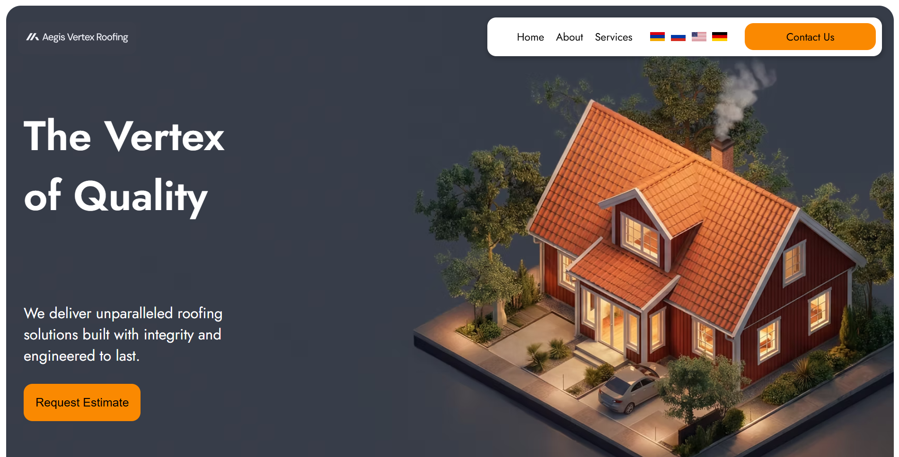

# 🏠 Roof

A modern and fully responsive roofing company website built with **React.js**.



---

## 🌐 Live Demo

🔗 **https://arturmk099-dev.github.io/Roof/**

---

## ✨ Features

- ⚛️ Built with React.js
- 🌍 Multi-language support (Armenian, Russian, English, German)
- 📱 Fully responsive design
- 🎞️ Image carousel using React Slick
- ✨ Smooth scroll animations
- 🌐 Internationalization with i18next
- 🧩 Component-based architecture
- ⚡ Fast and optimized performance

---

## 🛠️ Technologies

- React.js
- JavaScript (ES6+)
- HTML5
- CSS3
- React Router
- React Slick
- Slick Carousel
- i18next
- React i18next

---

## 📱 Responsive

The website is optimized for:

- 📱 Mobile
- 📲 Tablet
- 💻 Laptop
- 🖥️ Desktop

---

## 🌍 Supported Languages

- 🇦🇲 Armenian
- 🇷🇺 Russian
- 🇺🇸 English
- 🇩🇪 German

Users can instantly switch between all four languages.

---

## 🚀 Installation

Clone the repository:

```bash
git clone https://github.com/ArturMk099-dev/Roof.git
```

Install dependencies:

```bash
npm install
```

Run the project:

```bash
npm start
```

Build for production:

```bash
npm run build
```

Deploy to GitHub Pages:

```bash
npm run deploy
```

---

## 👨‍💻 Author

**Artur Mkrtchyan**

GitHub:
https://github.com/ArturMk099-dev

---

⭐ If you like this project, don't forget to leave a Star!